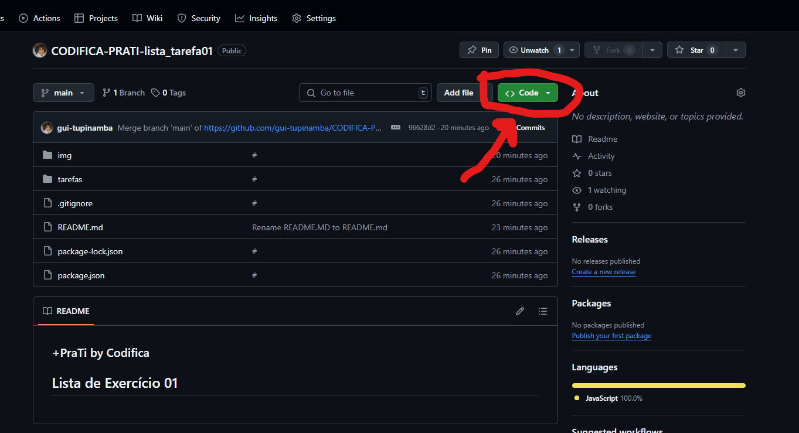
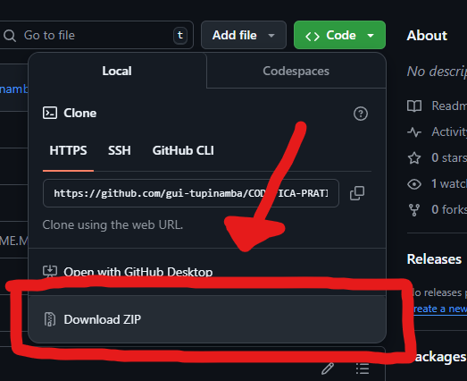

#   by Codifica
## Lista de Exercício 01

### Como configurar e executar os exercícios localmente:
- #### Node.js, como baixar e instalar => https://www.youtube.com/watch?v=6ggFpCNNeGM
- #### Baixe o atual repositório para seu computador:

- #### Como instalar as dependências:
  Abra o terminal na pasta que você baixou, e instale as dependências utilizando o comando "npm install"